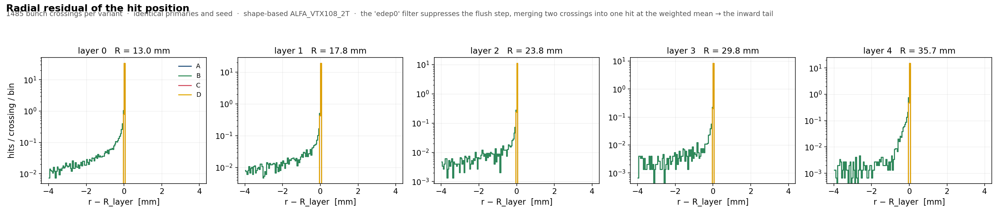
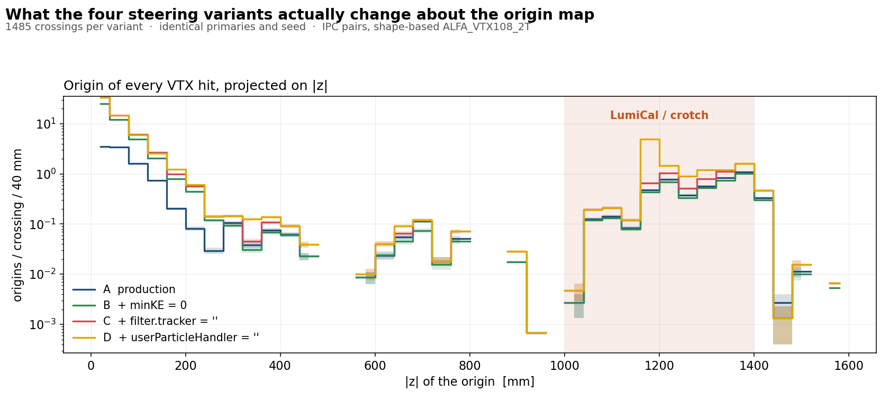
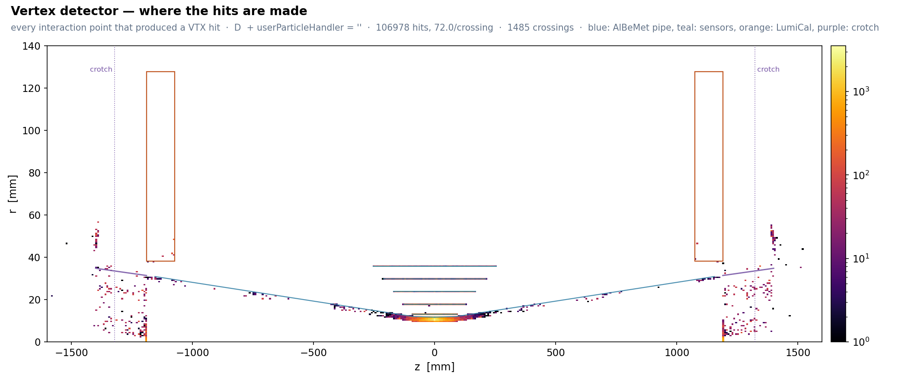
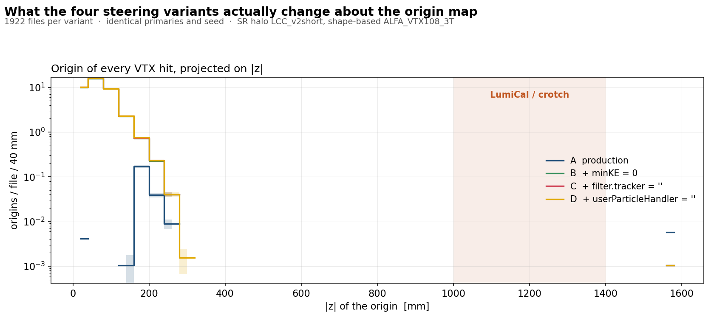
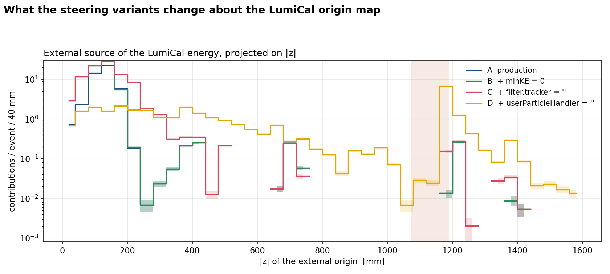
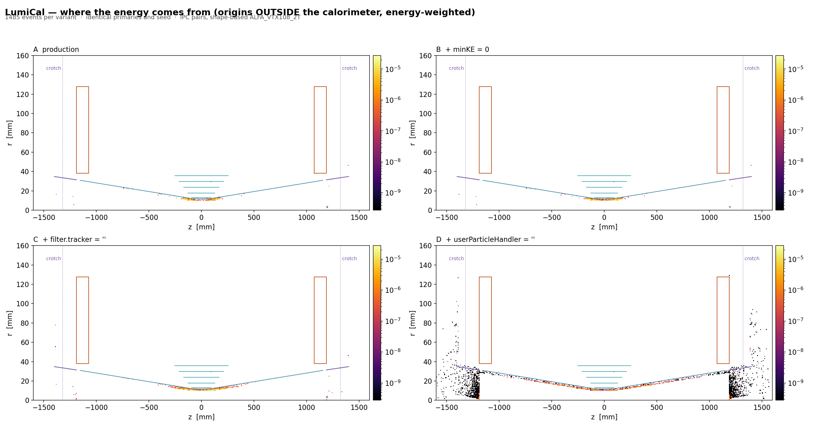

# ddsim steering variants: hits and MC-truth origins (ALFA, shape-based MDI)

2026-09-16. Shape-based `ALFA_VTX108` (aciarma_mdi_v2). IPC pairs (LCC_V105, 2T, **1485 BX**) and SR halo (LCC_v2short, 3T, **1922 files**). Same primaries and seed in every variant, field settings as in `ALFA_steer.py`.

| | cumulative change |
|---|---|
| **A** | production: `filter.tracker='edep0'`, `Geant4TVUserParticleHandler`, `minimalKineticEnergy=1 MeV` |
| **B** | + `minimalKineticEnergy = 0` |
| **C** | + `filter.tracker = ''` |
| **D** | + `userParticleHandler = ''` |

Origin: production vertex of the hit maker (for a primary, its first daughter vertex before the hit). Near = |z| < 250 mm, fwd = |z| ≥ 1000 mm.

## Conclusions

- **A→B**: hits unchanged; soft secondaries get truth. VTX origins found 22→75 % (IPC), 0.6→97 % (SR). Size ×1.10 (IPC), ×1.05 (SR).
- **B→C**: the only step that changes hits. `edep0` drops the zero-deposit flush step, so two crossings of a cylinder merge into one hit at r < R. IPC **+31.8 % hits**, displaced 11 % → 0, edep/hit 56→42.5 keV. SR +1.1 %. Size ×1.04 (IPC), ×1.00 (SR).
- **C→D**: hits unchanged; particles born in the 149 mrad cone outside `tracking_volume` get truth. Decisive for the LumiCal, required for shielding studies; ×1.8 forward VTX origins for IPC, no effect for SR. Size **×1530 (IPC)**, ×1.83 (SR).
- `filter.tracker` does not act on the LumiCal (calorimeter SD). The layer-4 φ≈0 peak is identical in all variants, so it is physical.

| file size | IPC MB/BX | SR MB/file |
|---|---|---|
| A | 0.118 | 22.1 |
| B | 0.129 | 23.2 |
| C | 0.135 | 23.3 |
| D | 207 | 42.6 |

IPC D is 307 GB for 1485 BX. SR files are already large in A because each stores its ~270k input photons.

## VTX

| IPC | hits/BX | displ. % | origin % | near | fwd |
|---|---|---|---|---|---|
| A | 67.1 | 11.1 | 22.5 | 14297 | 7194 |
| B | 67.1 | 11.1 | 75.1 | 67442 | 6547 |
| C | 88.4 | 0 | 75.2 | 87443 | 10027 |
| D | 88.4 | 0 | 81.5 | 87269 | 18285 |

| SR | hits/file | displ. % | origin % | near | fwd |
|---|---|---|---|---|---|
| A | 39.5 | 0.02 | 0.6 | 420 | 11 |
| B | 39.5 | 0.02 | 97.2 | 73681 | 2 |
| C | 39.9 | 0 | 97.2 | 74492 | 2 |
| D | 39.9 | 0 | 97.3 | 74528 | 2 |

SR hits come from secondaries (94.6 %) born at |z| < 250 mm. The forward MDI does not contribute. Under A the map is empty because all SR secondaries are sub-MeV.

## LumiCal (IPC, 444 contributions/BX)

| | blind % | own shower % | external % | ext near | ext fwd |
|---|---|---|---|---|---|
| A | 89.3 | 0.1 | 10.6 | 68337 | 432 |
| B | 83.7 | 0.1 | 16.2 | 105256 | 432 |
| C | 79.2 | 0.1 | 20.7 | 129644 | 747 |
| D | 0.0 | 92.8 | 7.2 | 15288 | 13804 |

- With production settings 89 % of the energy has no origin. D shows 93 % is the LumiCal's own shower.
- A/B/C also **mis-locate** origins near the IP (C: 8.5× D) and miss the forward source (D: 18× C), which peaks at |z| ≈ 1160–1200 mm.
- A LumiCal shielding study needs D.
- SR gives 0.17 contributions/file, so it is qualitative only. Same pattern (A 100 % blind, D 97 % own shower).

Data: `/ceph/.../ALFA/ddsim/{ipc_fccee/FCCee_Z_LCC_V105/ALFA_VTX108_2T,sr_fccee/LCC_v2short_halo/ALFA_VTX108_3T}_variants/`. All plots: `public_html/fccee/beam_backgrounds/ALFA/steering_variants{,_SR}/`.
